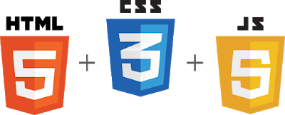

## Frontend tutorials and tips for starters and beginners

There a lot of resources available online for learning frontend web development so one will definitely get confused while beginning with web development. I will try to help you by giving some tips, tutorials and reference which will definitely help you. The main thing in web development is consistency, do not quit if you have started with it. Try making small projects with whatever you have learnt. I will also provide some good mini projects on which you can work on while learning web development and would help you with some steps on how to complete them.

### HTML
For html all the tutorials availble online are pretty much good and same so start with anyone and if you have no idea then i would prefer [w3schools](https://www.w3schools.com/html/). I would suggest not to waste much time in learning html since just the basic knowledge of html would be enough at beginning as you will use html a lot while making websites so you will eventually become profecient in it.

### CSS (Cascading Style Sheets)
#### Tutorials:

Websites: 
[w3schools](https://www.w3schools.com/css/)

Youtube Tutorial: 
[Net Ninja](https://www.youtube.com/channel/UCW5YeuERMmlnqo4oq8vwUpg)

Reference:
[Mozilla Developers](https://developer.mozilla.org/en-US/docs/Web/CSS)
[CSS Tricks](https://css-tricks.com/)

CSS seems to be very easy at beginning but let me tell you the truth, you will feel very hard while actually applying it in making a webpage.There will be times when you will starve fixing some elements at that time I would suggest to read about the anomalies of the css properties you are using or try reading about the html tag you are using since there are some default behaviour of html tags which you have to overwrite to get what you want.

### javaScript
#### Tutorials:

Websites: 
[javaScript.info](https://javascript.info/)

Youtube Tutorial: 
[Net Ninja](https://www.youtube.com/channel/UCW5YeuERMmlnqo4oq8vwUpg)

Reference: [Mozilla Developers](https://developer.mozilla.org/en-US/docs/Web/JavaScript)

If you are familiar with any other programming or scripting language then your learning curve will be not so high in js. Try learning by making as many projects you can wether it can be mini, small or even big.
