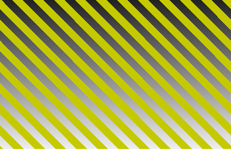

## CSS Gradeints can do a lot more than you think.

In this blog you will get to know about different patterns you can make with css gradients.

I will be using the same HTML template for each of the example.
```
<!DOCTYPE html>
<html>
<head>
    <link rel="stylesheet" href="style.css" type="text/css" />
</head>
<body>
    <div class="gradient"></div>
</body>
</html>
```

1. simple use of gradients to make stripes
```
/*style.css*/
.gradient{
    display: block;
    content: '';
    width: 80%;
    margin: 20px auto;
    height: 44vh;
    background: repeating-linear-gradient(45deg , #7986CB, #7986CB 10px, #C5CA00 10px, #C5CA00 20px);
}
```
It would look something like this.


2. By Making one of the color stops to transparent we can see the background gradient in place of the transparent stripes.
```
/*style.css*/
.gradient{
    display: block;
    content: '';
    width: 80%;
    margin: 20px auto;
    height: 44vh;
    background: repeating-linear-gradient(45deg , transparent, transparent 10px, #C5CA00 10px, #C5CA00 20px),
        linear-gradient(to top, #eee, black );
}
```
It would look something like this.



3. The First gradient is at the top of the stack so we can use the alpha value of the rgba in top graients to view the gradient below it.
```
/*style.css*/
.gradient{
    display: block;
    content: '';
    width: 80%;
    margin: 20px auto;
    height: 44vh;
    background: linear-gradient(to top, rgba(224,67,54,0.5), rgba(239,154,154,0.5)), repeating-linear-gradient(to top , black, black 4px, #C5CA00 4px, #C5CA00 8px);
}
```
It would look something like this.


4. Full crosses with three layered gradients
```
/*style.css*/
.gradient{
    display: block;
    content: '';
    width: 80%;
    margin: 20px auto;
    height: 44vh;
    background:
        repeating-linear-gradient(45deg, rgba(229,115,115,0.25), rgba(229,115,115,0.25) 5px, transparent 5px, transparent 10px),
        repeating-linear-gradient(-45deg, rgba(229,115,115,0.25), rgba(229,115,115,0.25) 5px, transparent 5px, transparent 10px),
        linear-gradient(to top, rgba(224,67,54,0.5), rgba(239,154,154,0.5));
}
```
It would look something like this.


5. Simple Squares
```
/*style.css*/
.gradient{
    display: block;
    content: '';
    width: 80%;
    margin: 20px auto;
    height: 44vh;
    background:
        repeating-linear-gradient(to top, transparent, transparent 10px, black 10px, black 20px),
        repeating-linear-gradient(to left, white, white 10px, black 10px, black 20px);
}
```
It would look something like this.


6. Multiple Circles
```
/*style.css*/
.gradient{
    display: block;
    content: '';
    width: 44vh;
    margin: 20px auto;
    height: 44vh;
    background:
        radial-gradient(
            circle,
            #5D9634,
            #5d9634 50%,
            #538C2B 50%,
            #538C2B 100%
        );
    background-size: 20px 25px;
}
```
It would look something like this.


7. Miscellaneous
```
/*style.css*/
.gradient{
    display: block;
    content: '';
    width: 44vh;
    margin: 20px auto;
    height: 44vh;
    background:
        radial-gradient(
            circle,
            purple,
            #5D9634,
            #5d9634 50%,
            #538C2B 50%,
            #538C2B 100%
        );
    background-size: 20px 25px;
}
```
It would look something like this.


8. Violet Circles
```
/*style.css*/
.gradient{
    display: block;
    content: '';
    width: 44vh;
    margin: 20px auto;
    height: 44vh;
    background:
        radial-gradient(
            circle,
            purple,
            purple 50%,
            #4B026F 50%,
            #4B026F
        );
    background-size: 20px 25px;
}
```
It would look something like this.


9. We can use background-size property since backgrounds are repeated automatically and here the linear gradinets are applied as squares of 56px
```
/*style.css*/
.gradient{
    display: block;
    content: '';
    width: 44vh;
    margin: 20px auto;
    height: 44vh;
    background:
        linear-gradient(
            45deg,
            #5D9634,
            #5d9634 50%,
            #538C2B 50%,
            #538C2B 100%
        );
    background-size: 56px;
}
```
It would look something like this.


10. If the second value in background size is smaller than the first one than the square of the dimenssions (20px)X(20px) gets cropped 10px horizontally from top
```
/*style.css*/
.gradient{
    display: block;
    content: '';
    width: 44vh;
    margin: 20px auto;
    height: 44vh;
    background:
        linear-gradient(
            45deg,
            #5D9634,
            #5d9634 50%,
            #538C2B 50%,
            #538C2B 100%
        );
    background-size: 20px 10px;
}
```
It would look something like this.


11. When the larger value acts as the dimmension of square and the smaller value acts as the cropping factor when the first value acts as the dimmension and the cropping is done horizontally from top of the square whareas when the second value acts as the dimmension then the image gets symetric to the plain and is rotated 45 deg clockwise
```
/*style.css*/
.gradient{
    display: block;
    content: '';
    width: 44vh;
    margin: 20px auto;
    height: 44vh;
    background:
        linear-gradient(
            45deg,
            #5D9634,
            #5d9634 50%,
            #538C2B 50%,
            #538C2B 100%
        );
    background-size: 20px 28px;
}
```
It would look something like this.


12. making grasses using the second value of background-size as the dimmension of the square
```
/*style.css*/
.gradient{
    display: block;
    content: '';
    width: 44vh;
    margin: 20px auto;
    height: 44vh;
    background:
        linear-gradient(
            45deg,
            #5D9634,
            #5d9634 50%,
            #538C2B 50%,
            #538C2B 100%
        );
    background-size: 20px 4px;
}
```
It would look something like this.


That's all for this blog
But you can do much more than this with gradients.
Try exploring you will be shocked.


