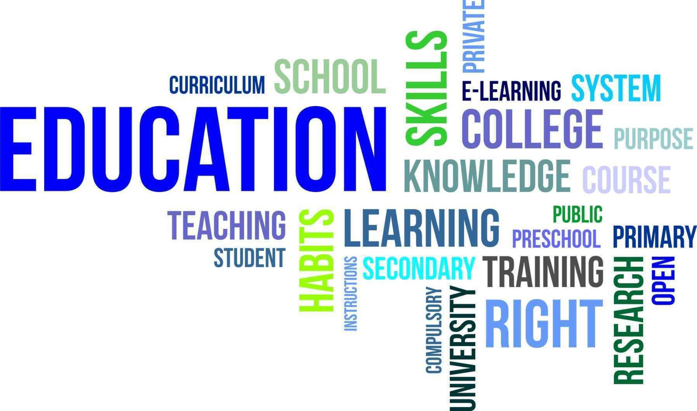
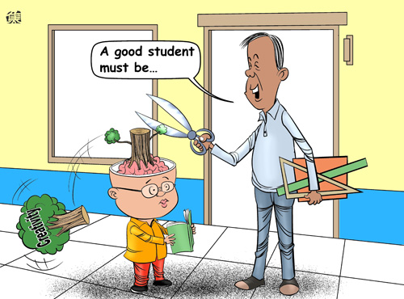
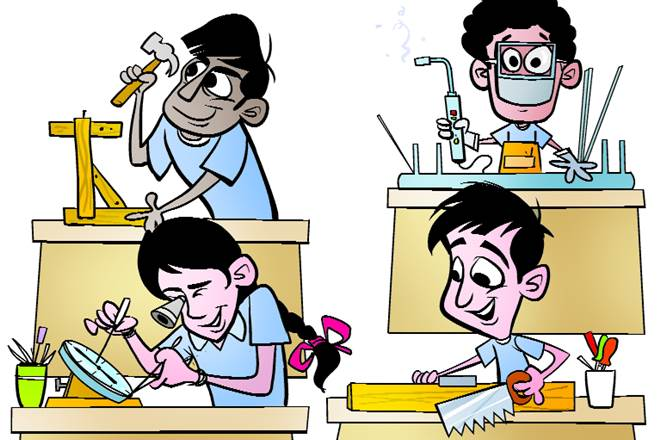

## 📝 My Thoughts on how education system is and how it should be

Well I would like to start with a question, are you satisfied with how you are teached, what you study, does any of your teacher ever tried to find out the best in you and support you with what you wanted to do? In most of the cases the answer is no. I know every one of us had thought once in their lifetime that how can people like Newton, Albert Einstein and many more of them discovered and unlocked the mysteries of how nature works, and why are we not able to do things like they did, the answer is simple they observed everything present in their environment and they don’t get confined to their syllabus they always read more as they wanted to learn more. I would like to share an experience with you all, I was 16 and I asked my mathematics teacher about a question, guess what did he replied … this topic, in which the question is based is not in our syllabus, stick to the syllabus. Great response, this thing happened with most of us isn’t it.

> The mind is not a vessel to be filled, but a fire to be kindled.

Somewhat somehow we are forced to stick to the syllabus. This is how we are teached, confined within the syllabus. Even in my graduation teachers are always confined to the syllabus no extra knowledge is provided by them. We are grown like this confined to our syllabus so most of us don’t even try getting out of the syllabus. My classmates always say “Jada padh ke kya krega question to syllabus se hi ayega” means, what will you do studying outside the syllabus, the questions will be from within the syllabus only. It’s not the problem of my classmates because it’s how they are told to study. The next part of bad education system is “Exams” yes you heard it right, Students are asked to give exams from the starting and are asked/forced to come first in class. That’s where the game begins every student tries to get better marks either by cheating or just learning out the whole fuckin syllabus. This thing needs to be changed. The very next resistance is our society, people around us only give respect to the ones who have better marks and do not respect the ones who have better knowledge or have some good skills in a specified field, the famous ones either ignore society or their parents are quite supportive but that’s not the case with most of us. We as students too need to change our habbit of just passing and scoring marks rather than doing some research work on something which we love and which we wanted to do. Yes I know it’s nearly impossible to change how we think because we are grown know and our mind-set are not ready to think outside the box. No one can change this except us, we are the future and everything depends on us.

I have my plans to at least change some part of the system, my plans include opening a school which would let students think differently as there would be no syllabus, only amazing teachers, students will be able to attend any class they want any subject they want, they will be free to do anything in any lab, no restrictions, a very very big library so that students can find anything they want, this will be the school students would like to come. There is much about this school which cannot be discussed here, it will be frustrating for you so just wait until it opens!

> If a child can't learn the way we teach, may be we should teach the way they learn.