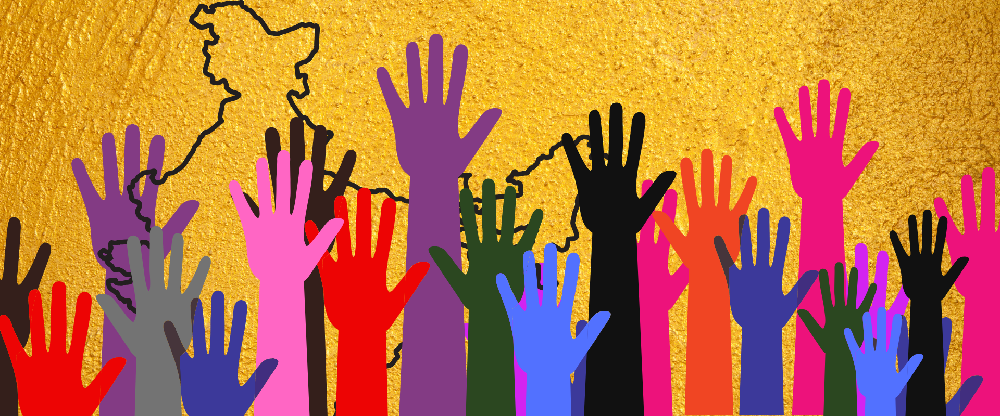

I would like to start with the fact that INDIA need to change a lot to stand up with other developed countries. But indeed our politicians are not able or willing to bring that change, why able? Because of the fear of losing votes or strikes of the opposition party and even due to the pressure from their own party. Why willing? Because some politicians never think of betterment of INDIA they just focus on how to have a lot on nation and how to make people fool. INDIA needs young politicians who have a great pack of patriotism within them. There are many such young people I have meet in my life who really want to work for the betterment of the people of our country but due to lack of opportunities to get into politics our country fails to utilize them. Due to some parties where the family rule is of great importance many good politicians are thrashed as being merely sub politicians in the party a big example of family rule is the INA(Indian National Congress), there are more such parties and I did not want to mention them. In fact the people of INDIA are the biggest friction in the development of our country. We only think about solutions of short term problems (that politicians will solve) while giving our vote which will not have a better result in future because short term problems will always prevail if long term ones are not solved. The government which solves long term problems and think for the future of country taking the present conditions is the best government (as per my knowledge).