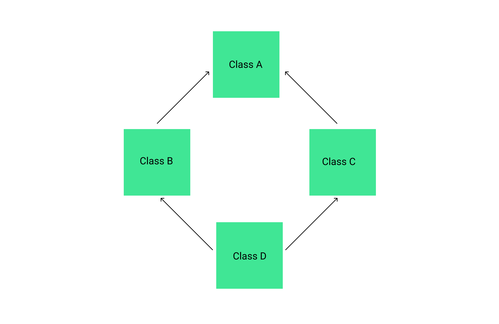
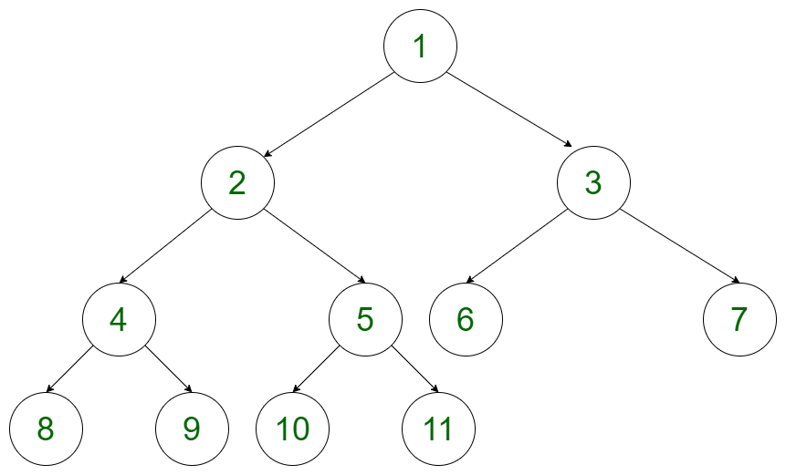

# Content
1. First technical round
2. Second technical round
3. HR round

## First technical round
1. Tell me something about yourself
  <br>- I told about my techical background and skills.
2. So, Abhijeet you know C, C++ and java. How would you rate youself in a scale of 10.
  <br>- I rated myself as 6/10 in C, 7/10 in C++ and 7/10 in java.
3. Ok, Tell me what is polymorphism.
  <br> - Polymorphism is a feature that allows one interface(name) to be used fo a general class of actions. There are two types of polymorphism<br>
  (a) Compile time polymorphism
  (b) Runtime polymorphism
4. What is runtime polymorphism?
  <br>- In runtime polymorphism the call to an overriden function is resolved at runtime.
5. Can you write a  program to illustrate the same
  <br>- Wrote the program using java
  ```
  class Karnataka
  {
    void sayHello(){
      System.out.println("Hello Karntaka");
    }
  }
  class Banagalore extends Karnataka
  {
    void sayHello(){
      System.out.println("Hello Banagalore")
    }
  }
  class State{
    public static void main(String args[])
    {
      Karnataka k = new Karnataka();
      k.sayHello();
      k = new Bangalore();
      k.sayHello();
    }
  }
  ```
6. Do you know about virtual functions in C++ and can you illustrate runtime polymorphism using the same.
  <br>- A virtual function is a member function which can be overriden by a derrived class.
  ```
  class Karnataka
  {
    public:
      virtual void sayHello()
      {
        cout<<"Hello karnataka";
      }
  };
  class Bangalore : public Karnataka{
    public:
      void sayHello()
      {
        cout<<"Hello Banagalore";
      }
  };
  void main()
  {
    Karnataka* state;
    Karnataka k;
    Bangalore b;
    state = &k;
    state->sayHello();
    state = &b;
    state->sayHello();
  }
  ```
7. Is there any problem in doing so:<br><br>
  
  <br>- Yes sir there will be some problem in doing so but i don't remeber. (This was very easy question but due to fear i was not able to answer it.)
8. So, abhijeet what is you favorite data structure
<br>- Trees

9. Give some applications of trees
  <br>- For storing heirarchial data, for solving different arithmetic expressions in preoder, postorder or inorder.
10. Can you write a function to search for a key in a binary tree
  <br>- yes sir,
  ```
  struct Node* searchInTree(struct Node* root, k)
  {
    if(root==NULL||k==root->data)
      return root;
    else if(k<root->data)
    {
      return searchInTree(root->left, k);
    } else
    {
      return searchInTree(root->right, k);
    }
  }
  ```
11. Explain the whole code by taking an example
  <br>- (I explained the code with an example and the interviewer agreed)
12. Conside a sentence find the number of spaces in that senetnce
  <br>- (I mentioned javaScript too in my resume so used it now)
  ```
  let myString="My string is awesome"
  console.log(myString.split(' ').length-1)
  ```
13. What if there are multiple spaces in between the words.
  <br>- (I got busted here☠️, after thinking for about 1 minute) Sorry sir, I am not getting any idea on how to do this.
14. Lastly, Do you have any questions to ask? (always ask a question)
15. Ok Abhijeet thank you, I will pass on the feedback to HR.

## Second technical round
1. Tell me something about yourself
  <br>- I told about my techical background and skills.
2. So, you have done two project can you show that to us.
  <br>- Sure sir, all the code of my projects are available on github and the link is given in my resume. (They didn't looked for it and resumed with next questions😌.)
3. You are from Jharkhand, When was Jharkhand founded.
  <br>- I am not confirm but I think 2000.
4. You said your favorite data structure is trees. Consider the tree below, what kind of tree is this.<br><br>
  
  <br>- This is a complete binary tree.
5. Can you write a program on the tree above for displaying the following pattern<br>
1->2->4->->8<br>1->2->4->9<br>1->2->5->10<br>1->2->5->11<br>1->3->6<br>1->3->7
  <br>-(I tried for about 2 minutes then said)<br> I am trying to use depth first traversals to solve this but i am not getting any concrete idea on how to solve this one.

6. Yes, depth first is needed to solve this one. Do you want any other question in any other data structure.
  <br>- Yes sir, I can solve questions on linked list.
10. Write a program to find wether a linked list is circular or not.
  <br>- Ok, I need to write just the function or whole program like defining and inserting etc.
11. Write whole program
  <br>- (Defined linked list using struct in c++, inserted some elements, made the linked list circual, implemented the code in a function).
  ```
  /*
  implementation code here like defining linked list
   using struct, inerting and making it circular
  */
  ...
  ...
  ...
  ...
  bool isCircular(Node* head){
    if(head==nullptr){
        return false;
    }
    else{
        Node* a=head;
        Node* b=head->next;
        
        while(a!=nullptr&&b->next!=nullptr){
            if(a==b){
                return true;
            }
            a=a->next;
            b=b->next->next;
        }
        
    }
    return false;
  }
  ```
12. Explain the code using an example
  <br>- (took an example to show the working of my code)
13. Do want some question in string manipulation
  <br>- yes sir, but i am not that good in string manipulation.
14. Consider the string "ab20jkl0jjhh64iajkl1024bs" you need to find the sum of the numbers in between the string like 20+0+64+1024 and tell us you approach.
  <br>- I am thinkin of spliting the string(again a silly answer 😱)
15. Why would you split, no this won't work, try iterating over the string.
  <br>- Ok, sir (know I understood how to do this) and completed a rough program for the same.
16. (I don't remember but due to some talk I mentioned hackerrank and then they asked) How many stars do you have in hackerrank?
  <br>- C++ 5 star and problem solving 3 stars(currently have 5 stars)
17. Do want a puzzle to solve?
  <br>- yes sir.
18. let's say there is a clock and the hour hand is stuck, how many times the clock will show correct time in 24 hours.
  <br>- 2 times
19. And what if the minute hand is stuck
  <br>- 24 times.
20. Do you have any questions to ask.
20. Ok, i will pass on my feedback to the HR.

## HR round
(I will not discuss my anwers for this round but provide the questions asked to me)
1. Tell me about yourself.
2. How were the previous rounds.
3. So you have 2 projects mentioned here wether they are completed or not, anyone uses your projects.
4. Is there anything you want to improve in yourself.
5. Consider a situation where two of you colleagues are involved in a quarrel how will you manage this situation.
6. There are people from different backgounds working in SAP how will you collaborate with them.
7. You will be having work and study both so can you handle it and if yes then how.
8. Any questions you want to ask? (always ask a questiont when requested)
