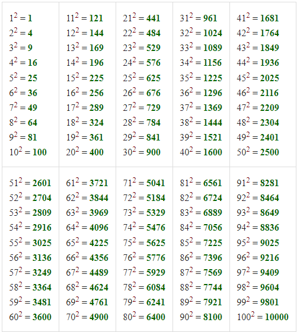

## Shortcuts to Finding squares of numbers upto 100

Squares have a very important role in every calulation If you are a mathematics student then it becomes a must to know the trick to find squares upto 100. The first prerequisite here is you must know the squares upto 30. If you don't know please learn and come back.

### For squares from 51 to 80
Since examples are always a perfect thing to understand any topic, let's take one. Let's say we want to find the square of 76.
#### Step 1:
Break the number in 50's like -> 76=50+26
#### Step 2:
Now the square of 2nd part i.e, 26 is 676 (I told previously you will need to learn squares upto 30). Now write down the last two digits i.e, 76 and take 6 as carry.
#### Step 3:
The first two digits of the answer is calculated as 25+26+6=57 (25 is constant for every number, 26 is the 2nd part of the number 76 and 6 is the carry from step 2).
So, our answer i.e, square of 76 is 5776.

### For squares from 31 to 50
Let us take an example again. Let's say we want to find the square of 41.
#### Step 1:
Break the number in 50's like -> 41=50-9 (Just like the previous case here also the answer has 4 digits)
#### Step 2:
We get the last two digits by squaring the second part i.e, square of (-9) = 81
#### Step 3:
Now the first two digits can calculated as 25-9=16 (25 is constant and -9 is the second part of the number 41 when breaked in terms of 50).
So, our answer in this case i.e, square of 41 is 1681. *(in case of carry in step 1 just add the carry in step 2)

### For squares from 81 to 100
Let us take an example again. Let's say we want to find the square of 82.
#### Step 1:
Break the number in 100's like -> 82=100-18 (Just like the previous case here also the answer has 4 digits except 100 itself)
#### Step 2:
We get the last two digits by squaring the second part i.e, square of (-18) = 324 (here the last two digits are 24 and 3 goes in carry)
#### Step 3:
Now the first two digits can calculated as 82-18+3=67 (here 82 is the number whose square is to be found, 18 is the 2nd part in step 1 and 3 is the carry from step 2)
So, our answer in this case i.e, square of 82 is 6724.

Congrats🎉 know you know how to square quickly.
Happy Squaring😊
