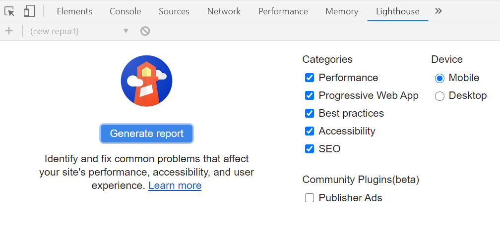
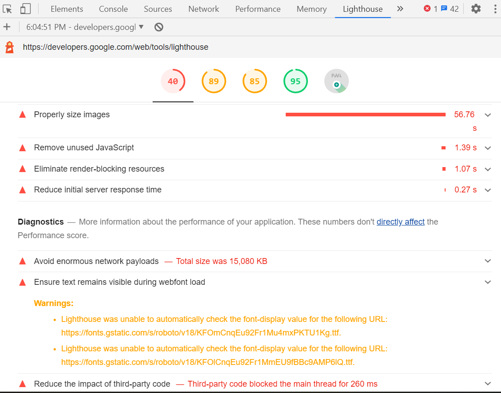

### Easy to use Auditing tool for your website

Lighthouse is an open-source, automated tool for improving the quality of web pages. You can run it against any web page, public or requiring authentication. It has audits for performance, accessibility, progressive web apps, SEO and more.

)

We have around 4 method's to run lighthouse. I will be focusing on the one provided with chrome dev tools.

Prerequisite: Google chorme and a webapp or website to test. (Note: Your webapp must be on https)

Step 1: Open chrome and visit the website
Step 2: Open chrome dev tools (Ctrl+Shift+i). Go to the Lighthouse tab where you can see the generate report button.

Step 3: Now there are many categories and devices. Select only the ones you want to audit.

Step 4: After selecting the categories. Click on generate report. 
(It would take some time about 60 seconds or so)

After that you will get the visulaized data about the audit's performed.

Step 5: On scrolling a little, You can also see why you got low percentage on some audits with the solutions.

You can now correct all the recomendations one by one.

Happy Auditing! 😊
