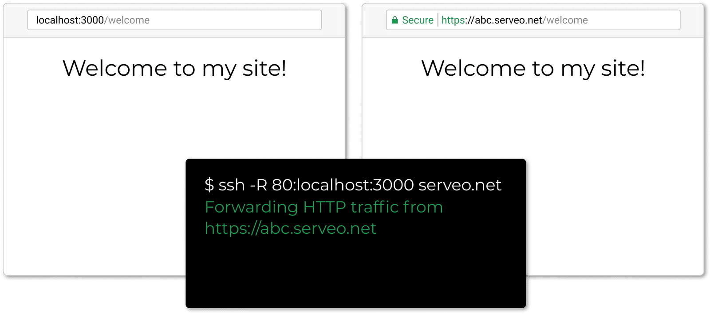

### Leave poor man's ngrok and get started with serveo

Serveo is an SSH server just for remote port forwarding. When a user connects to Serveo, they get a public URL that anybody can use to connect to their localhost server.
It is the most easiest way to get your local server to the internet all you need is an openssl installed and a code in your terminal. After pasting the code and hiting enter you will get a serveo.net subdomain like abc.serveo.net now you can use it for testing on different devices. 🎉

## For Linux
### Step 1:
Copy the code below on your terminal
>ssh -R 80:localhost:3000 serveo.net

(in place of 3000 enter the port number where your site is hosted locally)

## For Windows
### Step 1:
Install the openssl from the link [OpenSSL](https://drive.google.com/open?id=1LqjIjKk3RP2qcRFFkNePksyhzJZRFcUJ) or from any other source.
### Step 2:
Copy the code below on your command prompt
>ssh -R 80:localhost:3000 serveo.net

(in place of 3000 enter the port number where your site is hosted locally)

## Manuals for geeks🤓 (custom configuration) 
### Description:
>ssh -R 80:localhost:3000 serveo.net

In the code above -R option nstructs your SSH client to request port forwarding from the server and proxy requests to the specified host and port (usually localhost). A subdomain of serveo.net will be assigned to forward HTTP traffic.
3000 represents the port in which your website is running locally.

## Request a particular subdomain:
The subdomain is chosen deterministically based on your IP address, the provided SSH username, and subdomain availability, so you'll often get the same subdomain between restarts. You can also request a particular subdomain like:
> ssh -R incubo.serveo.net:80:localhost:8888 serveo.net

## Keep the connection alive
Use ServerAliveInterval to prevent an idle connection from timing out:
> ssh -o ServerAliveInterval=60 -R 80:localhost:8888 serveo.net